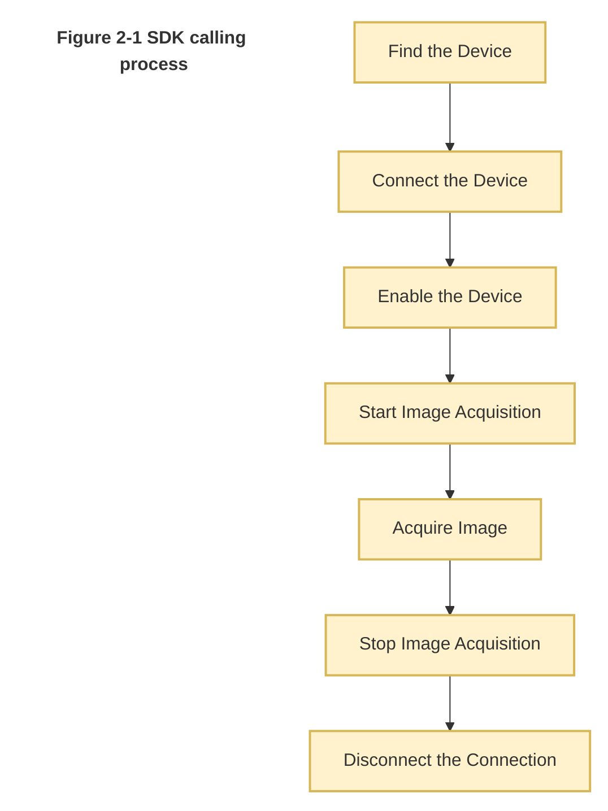

# Camera Control & Visual Recognition — Architecture and Implementation

## 1. Core Architecture: UI Thread + Worker Thread (Recommended)

To handle the "Open -> Stream -> Preview -> Recognize -> Close" workflow, a Producer-Consumer model is employed to maintain UI responsiveness and hardware stability.

### 1.1 Responsibility Breakdown

* #### UI Thread (Main Thread / PySide6):

  * Manages UI components (Start/Stop buttons, video display area, result logs).

  * Handles the lifecycle of the Worker thread.

  * Receives processed image signals from the Worker and renders them to the screen.

* Worker Thread (Background Process / QThread):

  * Initialization: Executes IMV_CreateHandle and IMV_Open.

  * Streaming (Loop): Uses IMV_GetFrame to continuously pull raw data from the camera.

  * Processing & Recognition:

    * Converts raw SDK buffers to OpenCV (numpy) format.
    
    * Core Logic: Invokes QR/Barcode recognition libraries (e.g., OpenCV wechat_qrcode or pyzbar).
    
    * Visual Annotation (Optional): Draws bounding boxes around detected codes.

* Communication: Emits signals containing the "processed image" and "decoded strings" back to the UI thread.

* Cleanup: Responds to stop signals by executing the sequence: IMV_StopGrabbing -> IMV_Close -> IMV_DestroyHandle.

## 2. Detailed Workflow

Startup Phase:

User clicks Start -> UI instantiates the Worker -> Thread starts.

Worker Internal: Connects to camera hardware -> Begins grabbing frames.

Runtime Phase (20-60 FPS Loop):

Worker: Grabs frame -> Color space conversion -> Barcode/QR Recognition -> Emits Image + Result String.

UI: on_frame_received updates the QLabel background; on_result_received updates the status bar or result list.

Teardown Phase:

User clicks Stop -> UI sends a stop signal to Worker -> Worker breaks the loop -> Sequentially destroys SDK handles -> Thread exits safely.

## 3. Recommended Tech Stack

UI Framework: PySide6 (Qt for Python).

Image Processing: OpenCV (for format conversion and basic drawing).

Recognition Libraries:

* opencv-contrib-python (Built-in wechat_qrcode offers extremely high recognition rates).

* pyzbar (Standard library for barcode recognition).

SDK: Huaray MVSDK (C API Wrapper).

## 4. Key Design Principles (Avoiding Freezes & Deadlocks)

Non-blocking Recognition: If the recognition algorithm is heavy (>30ms), do not process every single frame. Implement a skip-frame logic or a timer to recognize every 3rd or 5th frame while keeping the preview at full frame rate.

Thread Communication (Signals):

* image_signal(QImage): For real-time video preview.

* result_signal(str): For passing decoded text.

* error_signal(str): For catching SDK exceptions and alerting the user via UI modals.

Resource Management: Always use a finally block in the Worker's run() method to ensure IMV_DestroyHandle is called even if an runtime error occurs.

## 5. Pseudo-code Implementation
```
class CameraWorker(QThread):
    image_data = Signal(QImage)
    decoded_text = Signal(str)

    def run(self):
        # 1. Open Camera & Start Grabbing
        cam.open()
        try:
            while self.running:
                frame = cam.get_frame() # Fetch raw frame
                img = self.process(frame) # Convert to numpy/RGB
                
                # 2. Recognition Logic (Triggered by frequency/timer)
                text = barcode_detect(img)
                if text: 
                    self.decoded_text.emit(text)
                
                # 3. Emit for UI Preview
                q_img = to_qimage(img)
                self.image_data.emit(q_img)
        finally:
            # 4. Mandatory Resource Release
            cam.stop_grabbing()
            cam.close()
            cam.destroy()
```

Future Recommendations:

Performance: For multi-camera setups or ultra-high resolution, consider moving the recognition logic into a separate Multiprocessing pool to bypass the Python GIL.

Robustness: Implement a "Watchdog" in the UI thread to restart the Worker if the camera connection is lost (e.g., cable unplugged). 

## 6. The flowchart of steps to control camera with SDK


## 7. Use of functions in IMVApi
You may check other scripts in the project for referance